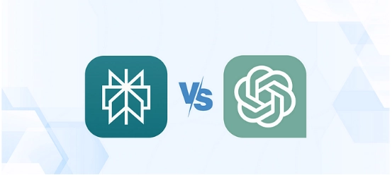

# Perplexity 与 ChatGPT 怎么选？实测对比告诉你答案

---

两个都是 AI 助手，一个号称"答案引擎"，一个是"聊天高手"。听起来很玄乎？其实没那么复杂。我花了些时间把这两个工具都折腾了一遍,现在来聊聊它们到底有什么不同,以及你该选哪个。

先说结论:如果你需要快速找到靠谱信息,Perplexity 更合适;如果你想要个能陪你聊天、帮你写东西的伙伴,ChatGPT 是更好的选择。当然,这只是表面区别,细节里藏着更多门道。

---

## 两个工具,各有各的活法

Perplexity 的定位很明确——它就是个"答案引擎"。你问它问题,它给你答案,还附上来源链接。整个过程干脆利落,没有废话。

ChatGPT 呢?更像个健谈的朋友。你可以跟它聊天,让它帮你写文章,改代码,甚至陪你扯淡。它的强项是对话和创作,而不是单纯给你一个答案。

### ChatGPT 适合谁用?

说白了,这几类人用 ChatGPT 会很爽:

**研究人员**:遇到复杂问题需要梳理思路时,ChatGPT 能帮你把混乱的信息理清楚。

**程序员**:写代码遇到 bug?让 ChatGPT 看看,它能帮你找问题,还能教你怎么改。

**职场打工人**:写报告、整理材料、回邮件...这些琐碎的活儿交给 ChatGPT,能省不少时间。

### Perplexity 又是给谁准备的?

Perplexity 的目标用户也很清晰:

**搜索重度用户**:受够了传统搜索引擎那一堆广告和无关结果?Perplexity 直接给你答案,还带上可靠来源。如果你正在寻找一个更高效的AI工具,👉 [Perplexity Pro年费成品号让你告别繁琐搜索，一键获取精准答案](https://shaoyumi.com/buy/64)

**信息收集者**:需要快速了解某个话题,又不想看一堆长文?Perplexity 的摘要功能帮你搞定。

**追求准确的人**:每个回答都有来源引用,你可以自己验证信息是否靠谱。

## ChatGPT:老牌选手,依然能打

OpenAI 这家公司不用多介绍了吧。ChatGPT 从推出到现在,已经成了 AI 助手的代名词。最新数据显示,它每周活跃用户超过 3 亿,每天收到的消息量突破 10 亿条。这个使用量级说明什么?说明确实有很多人离不开它。

ChatGPT 现在有两个版本:

**免费版**:用的是 GPT-4o mini 模型,基本功能都有,应付日常使用没问题。

**Plus 会员**:每月 20 美元,能用 GPT-4 和 GPT-4o,还有 o1 系列模型。另外可以用 DALL-E 3 生成图片,功能更全面。

## Perplexity:搜索和 AI 的混血儿

Perplexity 的创始团队来头不小——有 OpenAI、Meta 和 Coursera 的前员工,还有哈佛、斯坦福、伯克利这些名校的高材生。这个背景决定了 Perplexity 从一开始就走的是学术路线。

它既不是纯搜索引擎,也不是单纯的聊天机器人,而是把两者结合起来,叫做"答案引擎"。你问问题,它不光给你答案,还告诉你信息从哪来的。

Perplexity 也分两个版本:

**免费版**:所有人都能用,每 4 小时有 5 次专业搜索额度。

**Pro 版**:同样是每月 20 美元,可以用 GPT-4o、Claude 3、Sonar Large 等多个模型,还能上传文件分析,用 AI 生成可视化内容。想要更深度的搜索体验?👉 [Perplexity Pro年费成品号,全模型任选,365天持续服务](https://shaoyumi.com/buy/64)

## 具体对比:哪个更好用?

### ChatGPT 能干啥?

**聊天体验好**:ChatGPT 最大的优势就是对话自然。它能记住前面聊了什么,不用每次都重新解释背景。现在的 GPT-4o 还支持语音和图片输入,你可以直接跟它说话。

**内容创作强**:需要写博客、社交媒体文案、故事,甚至代码?ChatGPT 都能帮上忙。虽然比不上专业工具那么精细,但日常用绰绰有余。

**功能多样化**:除了写东西,ChatGPT 还能解数学题、分析图表数据、翻译语言、用 DALL-E 画图...基本上能想到的任务它都能试试。

**可扩展性强**:通过插件和自定义 GPT,你可以让 ChatGPT 连接外部工具,或者针对特定需求定制功能。

**数据分析**:可以直接上传文档让它分析,生成摘要或提取关键信息。

### Perplexity 有什么特色?

**实时搜索**:Perplexity 最牛的地方在于它能实时从网上抓取最新信息。不管是学术论文、新闻报道还是普通网页,都能找到最新内容。

**来源透明**:每个回答下面都会标注信息来源,你可以点进去验证。这对做研究的人来说太重要了。

**Copilot 辅助**:Perplexity 的 Copilot 功能会主动问你一些问题,帮你缩小搜索范围,让结果更精准。

**内容处理全面**:文本、代码、数学题、表格...Perplexity 都能处理。遇到长文章还能自动总结,省去自己阅读的时间。

**用户体验好**:支持深色模式,有 iOS 和 Android 应用,还有 Chrome 扩展。无论在哪都能用。

**多模态能力**:整合了 GPT-4 和 Claude,可以处理图片和 PDF,功能覆盖面更广。

## 几个常见问题

### Perplexity 是不是用的 ChatGPT 技术?

对,Perplexity 确实用了 OpenAI 的语言模型,但不止这一个。它还整合了其他模型。

### 两者最大的区别是什么?

技术底层不太一样。Perplexity 用的是自己的默认模型,搭配 Claude 3.5、GPT-4o 和 Llama 3.1。ChatGPT 则完全基于 OpenAI 的 GPT 系列。

### 多模态功能谁更强?

ChatGPT 在这方面更胜一筹。它支持语音、图片等多种输入方式。Perplexity 虽然也能处理文件,但在语音和图像交互上不如 ChatGPT 成熟。

## 怎么选?看你的需求

说了这么多,到底选哪个?

如果你需要**准确信息和可验证来源**,Perplexity 是更好的选择。它特别适合做研究、写论文、收集资料这类需要严谨的工作。每个答案都有来源引用,你可以自己判断信息是否靠谱。

如果你需要**创意和互动**,ChatGPT 更合适。它能帮你写东西、改代码、陪你聊天,甚至画图。功能更丰富,应用场景更广。

总结一句话:看中准确性和研究就选 Perplexity;需要灵活创作和互动就选 ChatGPT。最终还是取决于你的具体需求——是更偏向知识型研究,还是更看重创意和多样化应用。

---

其实不管选哪个,关键是找到适合自己工作流程的工具。两个都试试,看看哪个用得更顺手。毕竟工具是死的,人是活的,适合自己的才是最好的。如果你经常需要获取最新、最准确的信息,👉 [Perplexity Pro年费成品号让专业搜索变得轻松高效](https://shaoyumi.com/buy/64),或许能成为你研究和工作中的得力助手。
